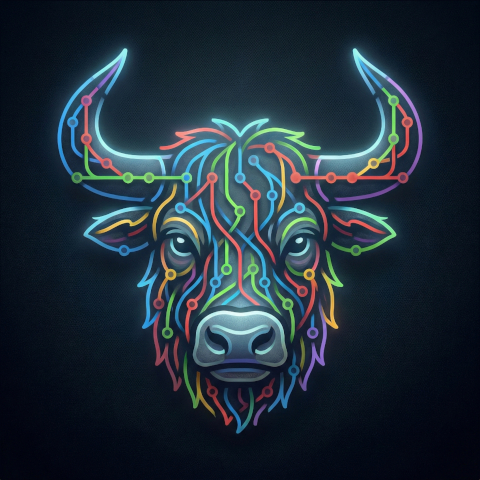

	<h1>GitYak</h1>
	
	<h2>Cross-platform GUI for Git.</h2>

About
---------------

Born out of necessity.

Like many of you, I love the visual workflow of tools like GitKraken. But I faced a major limitation: the inability to work on remote servers. I watched a feature request for this functionality gather dust [for 5 years and almost 500 votes](https://feedback.gitkraken.com/suggestions/223779/repository-management-on-remote-machine-using-ssh-connection)... it is still "Under consideration" 😴

Enough was enough. I decided to stop waiting and start building. This project is the result—a modern, web-based Git GUI designed from the ground up to handle both local and remote repositories seamlessly.
